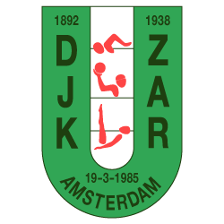

<p align="center">
  
</p>

# DJK-ZAR Water Polo Amsterdam

DJK-ZAR is a historic water polo club in Amsterdam West and a seven-time Dutch national champion.
Since 2018, the club has focused entirely on water polo, with five men’s teams and one women’s team competing at multiple levels.
The teams train and play at the Mercatorbad, combining competitive sport with a welcoming social community for new members.

Dependency-free static site for [djk-zar.nl](https://www.djk-zar.nl/), generated with a small Node.js build step.

## Requirements

- Node.js 22 or newer

No package installation is required.

## Development

```sh
npm run build       # clean build into dist/
npm run check       # build, structural checks, asset checks, and secret scan
npm run qa          # check plus local crawl and redirect verification
npm run preview     # serve dist/ at http://localhost:4173
```

Source pages live in `src/pages/`, shared rendering in `src/layout.mjs`, and static files in `src/static/`. The generated `dist/` directory is disposable and is not committed.

See [`docs/architecture-hosting.md`](docs/architecture-hosting.md) for the page and hosting contract. Assets are documented in [`docs/assets.md`](docs/assets.md).

## Agent-first workflow

Repository rules are in [`AGENTS.md`](AGENTS.md). Substantial features use one task at a time from [`plan/`](plan/README.md), created from [`plan/TEMPLATE.md`](plan/TEMPLATE.md). Page work treats SEO, sitemap membership, language alternates, accessibility, and browser verification as acceptance requirements.

## Deployment

Deploy only the contents of `dist/`, including `.htaccess`, to an Apache document root. Local FTP credentials belong in the ignored `.env.deploy`, copied from `.env.deploy.example`. Never commit the populated file.

## Security

`npm run check` scans tracked files for common credential patterns. Before making the repository public, review the full Git history as well. If a real credential has ever been committed, revoke it and rewrite the history before publishing.

## License

Copyright DJK-ZAR. All rights reserved. See [`LICENSE`](LICENSE). Third-party fonts retain their own licenses under `src/static/assets/fonts/`.
